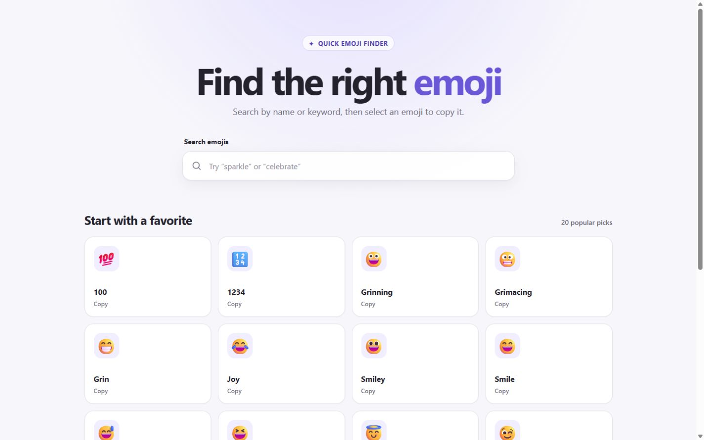

# Emoji Search 🔎

## Overview

Emoji Search is a lightweight React app for finding emojis by name or keyword
and copying them to the clipboard. It uses a local emoji dataset, so searches
are instant and require no API or backend.

## Features

- Real-time search by emoji title and keywords
- One-click clipboard copying with accessible feedback
- Result counts and a helpful empty state
- Keyboard-accessible emoji cards and visible focus states
- Responsive grid for desktop, tablet, and mobile

## Tech Stack

- React 19
- Create React App (`react-scripts`)
- JavaScript and CSS
- Local JSON emoji data
- GitHub Actions and GitHub Pages

## Screenshot



## Installation

Clone the repository and install the locked dependencies:

```bash
git clone https://github.com/mohadesehesmaeilzadeh/emoji-search.git
cd emoji-search
npm ci
```

Start the development server:

```bash
npm start
```

## Build

Create an optimized production build:

```bash
npm run build
```

Create React App writes the deployable files to the `build/` directory. The
project is configured for the `/emoji-search/` GitHub Pages base path.

## Live Demo

[Open Emoji Search on GitHub Pages](https://mohadesehesmaeilzadeh.github.io/emoji-search/)

## Repository

[github.com/mohadesehesmaeilzadeh/emoji-search](https://github.com/mohadesehesmaeilzadeh/emoji-search)
